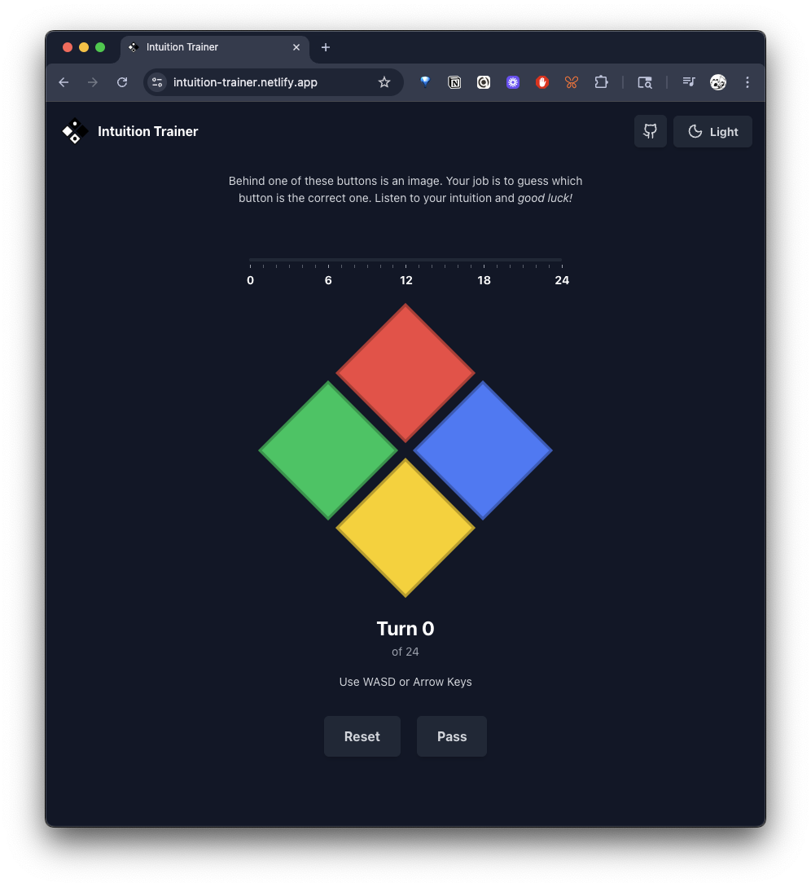
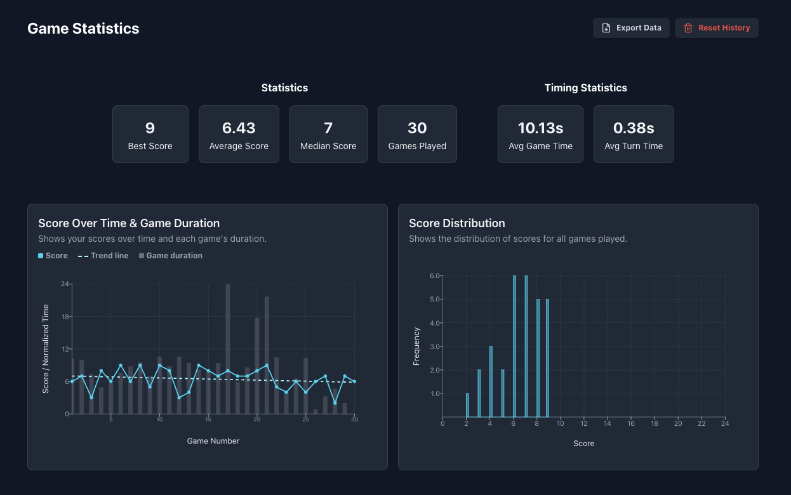

# Intuition Trainer

In 2019 I became very interested in consciousness and the nature of reality. I now believe that [consciousness is the fundamental building block of reality][1].

Around that same time I discovered the [ESP Trainer app][2], developed by [Russel Targ][3], who, according to his Wikipedia, is _"an American physicist, parapsychologist, and author who is best known for his work on remote viewing."_

I downloaded the app and thought it was pretty interesting!

After using it for a while, I started to wonder:

- How does the app work? Is it truly random?
- Was I doing better than random chance?
- Was I consistently getting higher scores, or improving over time?
- Was I doing better when I took my time with each turn, or when I sped through it and let my "intuition" guide me?

As a result, I decided to make this!

This version of the app comes with a few changes:

- The buttons are rotated 45° to make keyboard controls more intuitive
- Some simple statistics are displayed to help you assess your abilities
- You can export your game history as a JSON file if you want to analyze it in more detail

|  |  |
| ------------------------------------------------------------------------------ | --------------------------------------------------------------------- |

[1]: https://www.amazon.com/Meaning-Absurdity-bizarre-phenomena-reality-ebook/dp/B00770LCLW
[2]: https://apps.apple.com/us/app/esp-trainer/id336882103
[3]: https://en.wikipedia.org/wiki/Russell_Targ
[4]: https://github.com/alexthebake/intuition-trainer

## Demo

You can play the game here: https://intuition-trainer.netlify.app/

# Development

## Technologies

This project uses:

- React
- TypeScript
- Vite
- PandaCSS
- Victory Charts
- Zustand

This project has also been _heavily_ vibe coded (hence [`CLAUDE.md`](./CLAUDE.md)).

## Getting Started

This project uses [`bun`](https://bun.com/), so you can install your packages via

```sh
bun install
```

To start the development server simply:

```sh
bun dev
```
